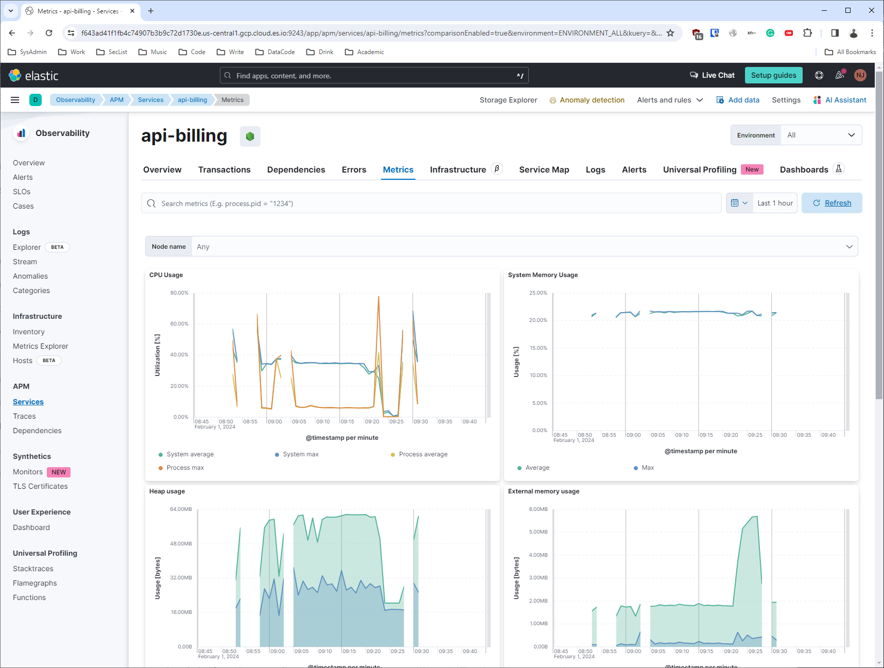
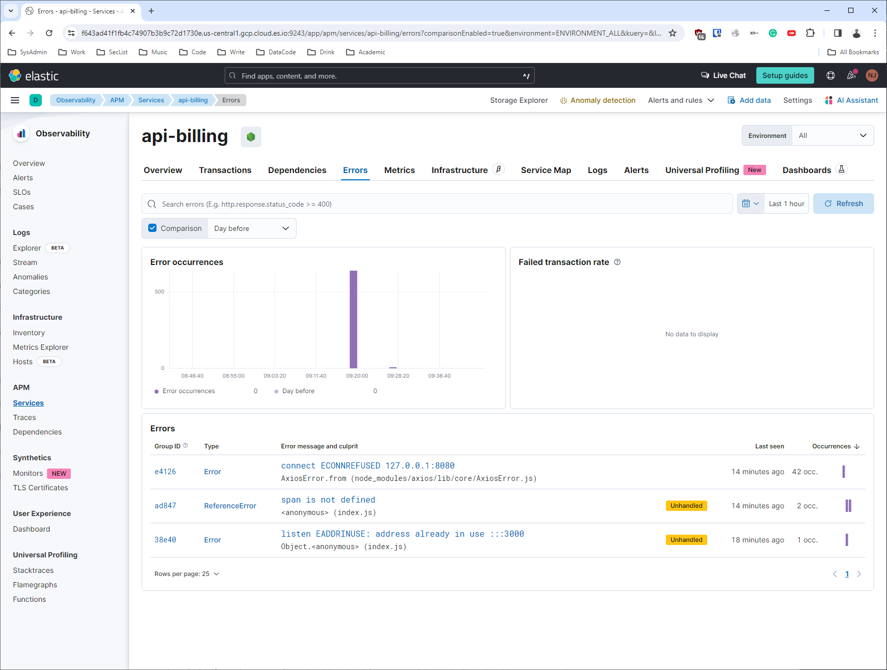

### Example of Service-to-Service Call
What I'm trying to do is actually make `api-billing` pass requests to `masking-api`, but at some point, when certain authentication headers are included, the masking is disabled, allowing the data to be read unmasked (not done yet). This setup is essentially a dummy test for playing with Elasticsearch APM.

To make service-to-service communication more resilient, we can add a sidecar proxy, like Envoy. This allows us to manage retries, handle timeouts, or implement circuit breakers.

